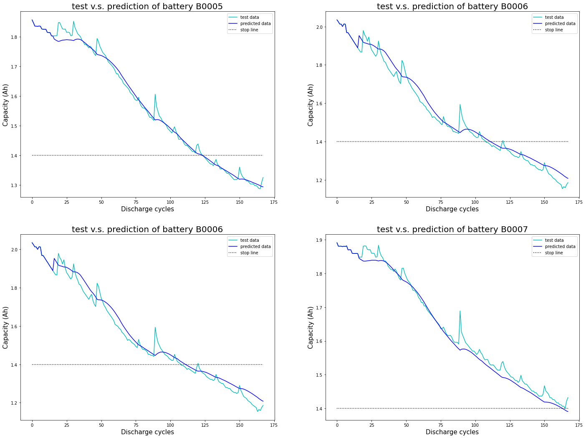

# NASA 锂电池数据集，基于 Python 的锂电池寿命预测（Remaining Useful Life，RUL）& （End Of Life，EOL）

**主要库版本：** 

- pytorch >=1.6.0

**预测结果**



**关于代码的说明：**

最近经常收到有同学问代码中一些问题，现汇总如下：

(1) build_sequences(text, window_size) 函数生成的预测数据为什么是序列不是下一个点？

序列[1, 2, 3, 4, 5]， build_sequences 函数生成的 x=[[1, 2, 3], [2, 3, 4]], y=[[2, 3, 4], [3, 4, 5]]的目的有两个：

一种是用序列预测序列，即 x=[1, 2, 3] 预测 y=[2, 3, 4]，x=[2, 3, 4] 预测 y=[3, 4, 5]；

一种是用序列预测下一个点，即 x=[1, 2, 3] 预测 y=[4]，x=[2, 3, 4] 预测 y=[5]；

本次实验中，我采用后者。所以，代码中，我训练的时候最后是取了train_y的最后一列：

y = np.reshape(train_y[:,-1]/Rated_Capacity,(-1,1)).astype(np.float32)


**版本更新：**  

- 2024年5月12日，修改部分代码以及添加预测图像

- 2022年2月24日，修改部分变量名字

- 2022年2月6日，解决错误“Tensor for argument #2 ‘mat1’ is on CPU, but expected it to be on GPU (while checking arguments for addmm)”

- 2021年12月1日， 添加数据读取模块

    如果原始数据集无法成功读取，可以直接选择加载我已经提取出来的数据：NASA.npy

    Battery = np.load('NASA.npy', allow_pickle=True)

    Battery = Battery.item()
    
 **有任何问题，欢迎留言！**

**Homepage:** http://zhouxiuze.com

**个人博客：** http://snailwish.com

**个人邮箱：** zhouxiuze@foxmail.com

**更多内容**

1. NASA 锂电池数据集，基于 Python 的锂电池寿命预测: https://snailwish.com/395/

2. NASA 锂电池数据集，基于 python 的 MLP 锂电池寿命预测: https://snailwish.com/427/

3. 马里兰大学锂电池数据集 CALCE，基于 Python 的锂电池寿命预测: https://snailwish.com/437/

4. NASA 和 CALCE 锂电池数据集，基于 Pytorch 的 RNN、LSTM、GRU 寿命预测: https://snailwish.com/497/

5. 基于 Pytorch 的 Transformer 锂电池寿命预测: https://snailwish.com/555/

**参考文献**

```
@article{chen2022transformer,
  title={Transformer network for remaining useful life prediction of lithium-ion batteries},
  author={Chen, Daoquan and Hong, Weicong and Zhou, Xiuze},
  journal={Ieee Access},
  volume={10},
  pages={19621--19628},
  year={2022},
  publisher={IEEE}
}
```
[PDF download](https://github.com/XiuzeZhou/xiuzezhou.github.io/tree/main/pub/Transformer.pdf)
